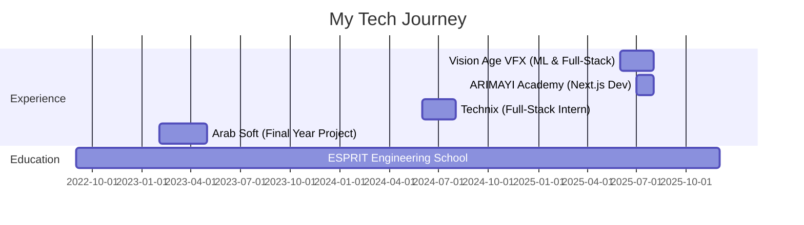

<div align="center">


<br>

<!-- Animated Badges -->
<p align="center">
  <a href="https://dhiaghouma.vercel.app"></a>
  <a href="https://linkedin.com/in/dhia-ghouma-725ab4212"></a>
  <a href="mailto:ghoumadhia01@gmail.com"></a>
  <a href="https://github.com/DhiaGhouma"></a>
</p>


<br>

<!-- Animated Profile Views Counter -->
<p align="center">
  
  
  
</p>

</div>

---


## 🎯 MISSION CONTROL


```typescript
interface Engineer {
    name: string;
    role: string[];
    location: string;
    education: string;
    languages: string[];
    superpowers: string[];
}

const dhia: Engineer = {
    name: "Dhia Ghouma",
    role: ["Full-Stack Architect", "AI/ML Engineer", "Problem Solver"],
    location: "Tunisia 🇹🇳",
    education: "Computer Science @ ESPRIT",
    languages: ["JavaScript", "TypeScript", "Python", "Java"],
    superpowers: [
        "🧠 Building AI recommendation systems",
        "⚡ Crafting real-time applications",
        "🎨 Designing seamless UX/UI",
        "🚀 Shipping production-ready code",
        "💡 Solving complex problems elegantly"
    ]
};

// Current Mission
const mission = {
    status: "ACTIVE 🟢",
    focus: ["AI Integration", "System Design", "Open Source"],
    goal: "Building products that matter",
    availability: "Open for collaboration"
};

export default dhia;
```

<br clear="right"/>

---


### 🎯 Quick Facts

🔭 **Currently:** Building intelligent apps & AI solutions  
🌱 **Learning:** Advanced ML, System Design, Cloud Architecture  
💡 **Interests:** Generative AI, Recommender Systems, Real-time Apps  
⚡ **Fun Fact:** Fitness enthusiast who debugs code between sets 💪

</div>

---

## 🛠️ Tech Stack & Tools

<div align="center">

### 💻 Languages


### 🎨 Frontend Development


### ⚙️ Backend Development


### 🗄️ Databases & Cloud


### 🤖 AI/ML & Data Science


### 🔧 Tools & Platforms


</div>

---

## 🏆 Featured Projects

<div align="center">

<table>
<tr>
<td width="50%">

### 🎨 ArtVerse
**AI-Powered Digital Art Platform**

Generative AI gallery enabling artists to create, showcase, and monetize digital artwork

`React` `Node.js` `AI Generation` `E-commerce`

[🔗 View Project](#)

</td>
<td width="50%">

### 🏋️‍♂️ Bodybuilding AI Assistant
**Smart Fitness Companion**

Flask microservice analyzing photos to generate personalized workout feedback

`Python` `Flask` `Computer Vision` `ML`

[🔗 View Project](#)

</td>
</tr>

<tr>
<td width="50%">

### 🎓 Course Recommender
**Intelligent Learning Platform**

ML-powered system suggesting personalized courses using KNN & SVM algorithms

`Python` `Scikit-learn` `Flask` `React`

[🔗 View Project](#)

</td>
<td width="50%">

### 🤝 Skill Exchange App
**AI Mentor Matching**

Smart platform connecting mentors with learners using ML classification

`MERN Stack` `Flask` `ML Models`

[🔗 View Project](#)

</td>
</tr>

<tr>
<td width="50%">

### 🥗 NutritionGO
**Smart Nutrition Advisor**

Semantic web + ML platform for personalized meal recommendations

`Python` `ML` `Semantic Web` `Viz`

[🔗 View Project](#)

</td>
<td width="50%">

### 🌱 UrbanGreen
**Eco-Project Recommender**

AI system matching ecological projects to NGOs

`Laravel` `Flask` `ML` `Sustainability`

[🔗 View Project](#)

</td>
</tr>
</table>

</div>

---

## 📊 GitHub Analytics

<div align="center">


</div>

---

## 🏅 GitHub Trophies

<div align="center">


</div>

---

## 💼 Professional Journey

<div align="center">



</div>

---

## 📈 Coding Activity

<div align="center">

<!--START_SECTION:waka-->
<!--END_SECTION:waka-->


</div>

---

## 🌟 Skills Visualization

<div align="center">


</div>

---

## 💡 Random Dev Quote

<div align="center">


</div>


---

## 📫 Let's Connect & Collaborate!

<div align="center">

**Got an exciting project? Let's build something amazing together! 🚀**

<a href="https://dhiaghouma.vercel.app" target="_blank">

</a>
<a href="https://linkedin.com/in/dhia-ghouma-725ab4212" target="_blank">

</a>
<a href="mailto:ghoumadhia01@gmail.com">

</a>

<br><br>

### 💬 Open to:
✅ Full-time opportunities | ✅ Freelance projects | ✅ Open source collaboration | ✅ Tech discussions


</div>