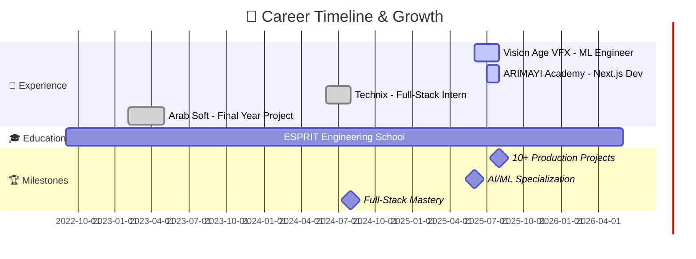
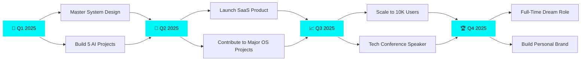

<div align="center">


<div align="center">
  
</div>

<br>

<!-- Animated Badges -->
<p align="center">
  <a href="https://dhiaghouma.vercel.app"></a>
  <a href="https://linkedin.com/in/dhia-ghouma-725ab4212"></a>
  <a href="mailto:ghoumadhia01@gmail.com"></a>
  <a href="https://github.com/DhiaGhouma"></a>
</p>


<br>

<!-- Animated Profile Views Counter -->
<p align="center">
  
  
  
</p>

</div>

---


## 🎯 MISSION CONTROL


```typescript
interface Engineer {
    name: string;
    role: string[];
    location: string;
    education: string;
    languages: string[];
    superpowers: string[];
}

const dhia: Engineer = {
    name: "Dhia Ghouma",
    role: ["Full-Stack Architect", "AI/ML Engineer", "Problem Solver"],
    location: "Tunisia 🇹🇳",
    education: "Computer Science @ ESPRIT",
    languages: ["JavaScript", "TypeScript", "Python", "Java"],
    superpowers: [
        "🧠 Building AI recommendation systems",
        "⚡ Crafting real-time applications",
        "🎨 Designing seamless UX/UI",
        "🚀 Shipping production-ready code",
        "💡 Solving complex problems elegantly"
    ]
};

// Current Mission
const mission = {
    status: "ACTIVE 🟢",
    focus: ["AI Integration", "System Design", "Open Source"],
    goal: "Building products that matter",
    availability: "Open for collaboration"
};

export default dhia;
```

<br clear="right"/>

---


## 🏆 ACHIEVEMENTS UNLOCKED

<div align="center">

| 🎯 Metric | 📊 Achievement |
|-----------|---------------|
| **💼 Professional Experience** | 4+ Companies • 12+ Months |
| **🚀 Projects Shipped** | 10+ Production Apps |
| **🤖 AI Models Built** | 5+ ML Systems |
| **💻 Lines of Code** | 100,000+ |
| **☕ Coffee Consumed** | Infinity ♾️ |
| **🔥 Bugs Squashed** | Too many to count 🐛 |


</div>

---


## 🛠️ ARSENAL • TECH STACK

<div align="center">

### ⚡ CORE WEAPONS

<table>
<tr>
<td valign="top" width="33%">

#### 🎨 Frontend
<div align="center">  


</div>

</td>
<td valign="top" width="33%">

#### ⚙️ Backend
<div align="center">


</div>

</td>
<td valign="top" width="33%">

#### 🗄️ Databases
<div align="center">


</div>

</td>
</tr>
</table>

### 🤖 AI/ML ARSENAL


### 🔧 DEVOPS & TOOLS


### 💎 SKILL CONSTELLATION


</div>

---


## 🚀 FEATURED PROJECTS • HALL OF FAME

<div align="center">

<table>
<tr>
<td width="50%" valign="top">

### 🎨 [ArtVerse](https://github.com/DhiaGhouma)
 

**Next-Gen Digital Art Platform with Generative AI**

Revolutionary platform enabling artists to create, showcase, and monetize AI-generated artwork. Features include real-time collaboration, NFT integration, and advanced image generation.

**🔥 Tech Stack:**  
`React` `Node.js` `MongoDB` `TensorFlow` `Stripe` `AWS S3`

**✨ Highlights:**
- 🤖 Generative AI art creation
- 💰 Integrated payment system
- 🖼️ Artist portfolio management
- 📊 Analytics dashboard

[→ Explore Project](https://github.com/DhiaGhouma)

</td>
<td width="50%" valign="top">

### 🏋️‍♂️ [Bodybuilding AI Assistant](https://github.com/DhiaGhouma)
 

**Intelligent Fitness Companion with Computer Vision**

Smart fitness app analyzing user photos to provide personalized workout recommendations. Uses pose detection and body composition analysis.

**🔥 Tech Stack:**  
`Python` `Flask` `OpenCV` `TensorFlow` `React` `MongoDB`

**✨ Highlights:**
- 📸 Pose detection & analysis
- 💪 Custom workout plans
- 📈 Progress tracking
- 🎯 Goal-based recommendations

[→ Explore Project](https://github.com/DhiaGhouma)

</td>
</tr>

<tr>
<td width="50%" valign="top">

### 🎓 [Smart Course Recommender](https://github.com/DhiaGhouma)
 

**AI-Driven Learning Platform**

Intelligent course recommendation system using collaborative filtering and content-based algorithms (KNN, SVM) to match learners with optimal courses.

**🔥 Tech Stack:**  
`React` `Node.js` `Flask` `Scikit-learn` `MongoDB` `Redis`

**✨ Highlights:**
- 🧠 ML recommendation engine
- 🎯 Personalized learning paths
- 📊 Student analytics
- ⚡ Real-time updates

[→ Explore Project](https://github.com/DhiaGhouma)

</td>
<td width="50%" valign="top">

### 🤝 [Skill Exchange Platform](https://github.com/DhiaGhouma)
 

**Smart Mentor-Learner Matching System**

Revolutionary platform connecting mentors with learners using AI classification and intelligent matching algorithms based on skills, interests, and availability.

**🔥 Tech Stack:**  
`React` `Node.js` `MongoDB` `Flask` `Socket.io` `ML Models`

**✨ Highlights:**
- 🎯 AI-powered matching
- 💬 Real-time chat
- 📅 Scheduling system
- ⭐ Rating & reviews

[→ Explore Project](https://github.com/DhiaGhouma)

</td>
</tr>

<tr>
<td width="50%" valign="top">

### 🥗 [NutritionGO](https://github.com/DhiaGhouma)
 

**Intelligent Nutrition & Meal Planning**

Advanced nutrition platform leveraging semantic web technologies and ML to deliver personalized meal recommendations with detailed nutrient analysis.

**🔥 Tech Stack:**  
`Python` `Flask` `RDF` `SPARQL` `ML` `D3.js` `MongoDB`

**✨ Highlights:**
- 🥗 Personalized meal plans
- 📊 Nutrient visualization
- 🎯 Goal-based recommendations
- 📱 Mobile-responsive design

[→ Explore Project](https://github.com/DhiaGhouma)

</td>
<td width="50%" valign="top">

### 🌱 [UrbanGreen](https://github.com/DhiaGhouma)
 

**Eco-Project Recommendation Engine**

AI-powered platform connecting NGOs and associations with ecological urban projects. Uses ML to match organizations with sustainable initiatives.

**🔥 Tech Stack:**  
`Laravel` `Flask` `Python` `ML` `MySQL` `Vue.js`

**✨ Highlights:**
- 🌍 Project matching algorithm
- 📈 Impact tracking
- 🤝 NGO collaboration tools
- 🌿 Sustainability metrics

[→ Explore Project](https://github.com/DhiaGhouma)

</td>
</tr>
</table>

</div>

---


## 📊 BATTLE STATISTICS

<div align="center">


</div>

---


## 🐍 CONTRIBUTION SNAKE

<div align="center">

<picture>
  <source media="(prefers-color-scheme: dark)" srcset="https://raw.githubusercontent.com/DhiaGhouma/DhiaGhouma/output/github-contribution-grid-snake-dark.svg">
  <source media="(prefers-color-scheme: light)" srcset="https://raw.githubusercontent.com/DhiaGhouma/DhiaGhouma/output/github-contribution-grid-snake.svg">
  
</picture>

</div>

---


## 💼 PROFESSIONAL JOURNEY

<div align="center">



<table>
<tr>
<td align="center" width="25%">

<br><b>🚀 Vision Age VFX</b>
<br><sub>ML & Full-Stack Engineer</sub>
<br><i>Jun 2025 - Aug 2025</i>
</td>
<td align="center" width="25%">

<br><b>💻 ARIMAYI Academy</b>
<br><sub>Next.js Developer</sub>
<br><i>Jul 2025 - Aug 2025</i>
</td>
<td align="center" width="25%">

<br><b>⚡ Technix</b>
<br><sub>Full-Stack Intern</sub>
<br><i>Jun 2024 - Aug 2024</i>
</td>
<td align="center" width="25%">

<br><b>🎯 Arab Soft</b>
<br><sub>Final Year Project</sub>
<br><i>Feb 2023 - May 2023</i>
</td>
</tr>
</table>

</div>

---


## 🎯 CURRENT FOCUS & GOALS

<div align="center">

<table>
<tr>
<td width="33%" align="center">

### 🔭 Building
```yaml
type: Projects
status: In Progress
focus:
  - AI-powered apps
  - Real-time systems
  - Open source tools
goal: Impact millions
```

</td>
<td width="33%" align="center">

### 🌱 Learning
```yaml
type: Skills
status: Active
mastering:
  - System Design
  - Cloud Architecture
  - Advanced ML
  - Microservices
```

</td>
<td width="33%" align="center">

### 💬 Collaborating
```yaml
type: Opportunities
status: Open
looking_for:
  - Exciting projects
  - Tech discussions
  - Open source
  - Innovation
```

</td>
</tr>
</table>

</div>

---


## 💡 WISDOM OF THE DAY

<div align="center">


</div>

---


## 🎵 CURRENTLY VIBING TO

<div align="center">

[](https://open.spotify.com/user/31l4wot55vqrk73yfajnnkzufxyq)

</div>

---


## 📫 LET'S BUILD SOMETHING AMAZING TOGETHER

<div align="center">

<table>
<tr>
<td align="center" width="25%">

<br><b>Portfolio</b>
<br><a href="https://dhiaghouma.vercel.app">dhiaghouma.vercel.app</a>
</td>
<td align="center" width="25%">

<br><b>LinkedIn</b>
<br><a href="https://linkedin.com/in/dhia-ghouma-725ab4212">Let's Connect</a>
</td>
<td align="center" width="25%">

<br><b>Email</b>
<br><a href="mailto:ghoumadhia01@gmail.com">Drop a Line</a>
</td>
<td align="center" width="25%">

<br><b>GitHub</b>
<br><a href="https://github.com/DhiaGhouma">Follow Me</a>
</td>
</tr>
</table>

<br>

### 🚀 OPEN TO


<br><br>


### 💭 MY PHILOSOPHY


<br><br>


### 🌟 THANKS FOR STOPPING BY!


<br><br>

<!-- Footer Wave Animation -->


<!-- Visitor Counter -->
<br>


</div>

---

<div align="center">

### ⚡ FUN FACTS ABOUT ME

<table>
<tr>
<td align="center" width="20%">

<br><b>💪 Fitness</b>
<br><sub>Bodybuilding enthusiast<br>Code & gains</sub>
</td>
<td align="center" width="20%">

<br><b>⚽ Football</b>
<br><sub>Team player<br>On & off the field</sub>
</td>
<td align="center" width="20%">

<br><b>🎨 Modeling</b>
<br><sub>3D design<br>Creative mind</sub>
</td>
<td align="center" width="20%">

<br><b>🏕️ Camping</b>
<br><sub>Nature lover<br>Adventure seeker</sub>
</td>
<td align="center" width="20%">

<br><b>🎬 Cinema</b>
<br><sub>Film buff<br>Story enthusiast</sub>
</td>
</tr>
</table>

</div>

---

<div align="center">

### 🎓 EDUCATION & CERTIFICATIONS

| 🏫 Institution | 📚 Degree | 📅 Period | 🎯 Focus |
|----------------|-----------|-----------|----------|
| **ESPRIT** | Engineering in Computer Science | 2022 - Present | Full-Stack & AI/ML |
| **FSB** | Bachelor's in Software Engineering | 2020 - 2022 | Software Development |

</div>

---

<div align="center">

### 🌍 LANGUAGES

<table>
<tr>
<td align="center" width="33%">

<br><b>العربية</b>
<br><sub>Native • C2</sub>
</td>
<td align="center" width="33%">

<br><b>English</b>
<br><sub>Fluent • C2</sub>
</td>
<td align="center" width="33%">

<br><b>Français</b>
<br><sub>Intermediate • B2</sub>
</td>
</tr>
</table>

</div>

---

<div align="center">

### 📈 CODING ACTIVITY

<!--START_SECTION:waka-->
<!--END_SECTION:waka-->


</div>

---

<div align="center">

### 🏅 GITHUB ACHIEVEMENTS


</div>

---

<div align="center">

### 💬 TESTIMONIALS

> *"Dhia's ability to integrate AI into full-stack applications is exceptional. His code is clean, efficient, and production-ready."*  
> — **Tech Lead, Vision Age VFX**

> *"A passionate engineer who delivers beyond expectations. His problem-solving skills are outstanding."*  
> — **Project Manager, ARIMAYI Academy**

> *"Dhia combines technical excellence with creative thinking. A true asset to any development team."*  
> — **CTO, Technix**

</div>

---

<div align="center">

### 🎯 2025 ROADMAP



</div>

---

<div align="center">

### 🔥 RECENT ACTIVITY

<!--RECENT_ACTIVITY:start-->
<!--RECENT_ACTIVITY:end-->

<a href="https://github.com/DhiaGhouma"></a>

</div>

---

<div align="center">

### 🌟 PINNED REPOSITORIES

[](https://github.com/DhiaGhouma/ArtVerse)
[](https://github.com/DhiaGhouma/NutritionGO)
[](https://github.com/DhiaGhouma/UrbanGreen)
[](https://github.com/DhiaGhouma/BodybuildingAI)

</div>

---

<div align="center">

### 💝 SUPPORT MY WORK

<a href="https://www.buymeacoffee.com/dhiaghouma">
  
</a>
<a href="https://ko-fi.com/dhiaghouma">
  
</a>
<a href="https://www.patreon.com/dhiaghouma">
  
</a>

<br><br>

*If you find my projects helpful, consider buying me a coffee! ☕*  
*Every contribution helps me create more open-source tools and content.*

</div>

---

<div align="center">

### 🎨 ASCII ART

```
    ____  __    __________    ___________  ______  __  ____  ___    
   / __ \/ /   / /  _/ __ \  / ____/ __ \/ / __ \/ / / /  |/  /   
  / / / / /___/ // // /_/ / / / __/ / / / / / / / / / / /|_/ /    
 / /_/ / / __ \/ // // ____/ / /_/ / /_/ / / /_/ / /_/ / /  / /     
/_____/_/_/ /_/___/_/_/      \____/\____/_/\____/\____/_/  /_/      
                                                                      
      ╔═══════════════════════════════════════════════════╗
      ║  🚀 Full-Stack Engineer • AI Architect 🤖        ║
      ║  💻 Building the Future, One Line at a Time      ║
      ║  ✨ Open for Collaboration & Innovation          ║
      ╚═══════════════════════════════════════════════════╝
```

</div>

---

<div align="center">


### 🌈 FINAL THOUGHTS

*"In a world where you can be anything, be kind, be curious, and be the engineer who builds solutions that matter."*

**✨ Remember:** Every expert was once a beginner. Every project was once just an idea.  
**🚀 Keep coding. Keep learning. Keep building.**

<br>


<br><br>

**Made with** 💙 **and lots of** ☕ **by Dhia Ghouma**

<br>

[](https://github.com/DhiaGhouma?tab=repositories)
[](https://github.com/DhiaGhouma)

<br>


</div>